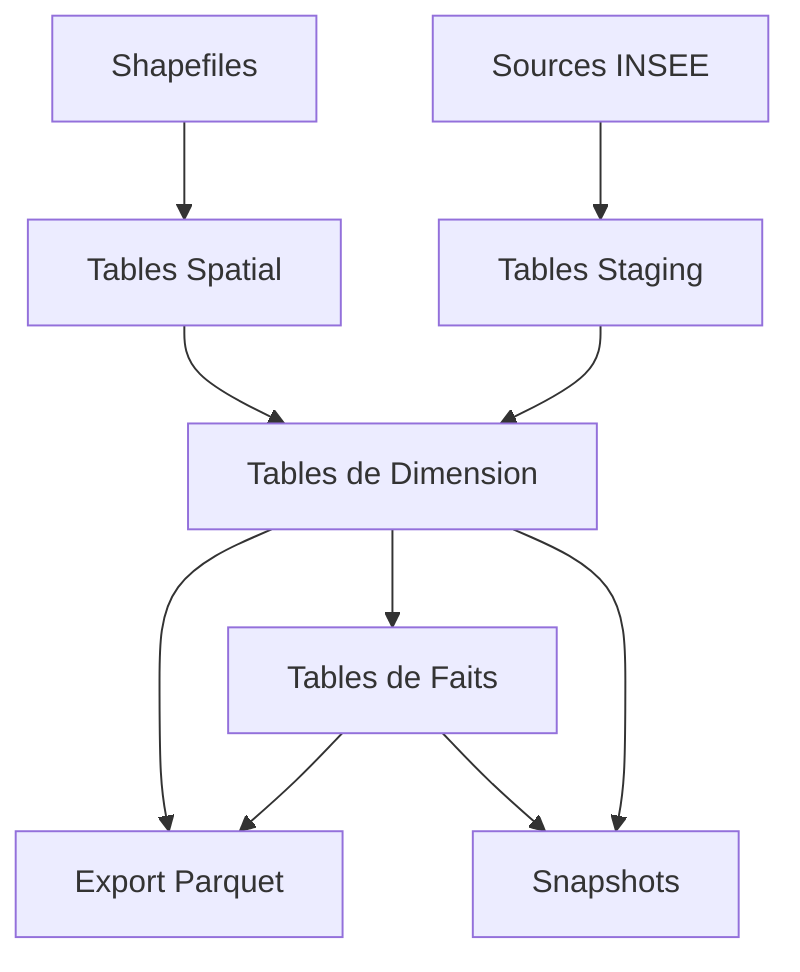

# 🗺️ Modélisation Géographique DBT

Un projet complet d'analyse géographique et démographique de la France métropolitaine utilisant dbt et DuckDB.


## 📋 Vue d'ensemble

Ce projet vous permet de:

- 🏢 Analyser les données géographiques de la France (régions, départements, arrondissements, communes)
- 👨‍👩‍👧‍👦 Explorer les données démographiques historiques (2006-2022)
- 🔄 Créer un modèle en étoile pour des analyses multi-niveaux
- 📊 Générer des exports en format Parquet optimisés pour l'analyse
- ⏱️ Suivre les changements dans le temps via des snapshots

## 🚀 Démarrage rapide

```bash
# Cloner le projet
git clone https://github.com/votre-nom/modelisation_dbt.git
cd modelisation_dbt

# Créer un environnement virtuel
python -m venv venv
source venv/bin/activate  # Sur Windows: venv\Scripts\activate

# Installer les dépendances
pip install dbt-duckdb

# Copier et configurer le profil
cp profiles.sample.yaml profiles.yaml

# Télécharger les données et lancer le projet
./script/setup.sh  # Sur Windows: script\setup.cmd
```

## 📚 Documentation

Pour générer et consulter la documentation complète du projet:

```bash
# Générer la documentation
dbt docs generate

# Lancer le serveur de documentation (accessible sur http://localhost:8080)
dbt docs serve
```

La documentation inclut:
- 📝 Description détaillée de toutes les tables et colonnes
- 🔀 Diagrammes de lignage montrant les dépendances
- ✅ Tests et validations disponibles
- 📊 Aperçu de la structure du modèle de données

## 💻 Commandes principales

### Modèles

```bash
# Exécuter tous les modèles
dbt run

# Exécuter un groupe spécifique
dbt run --select staging
dbt run --select intermediate
dbt run --select export

# Exécuter un modèle spécifique
dbt run --select dim_commune_metro
```

### Tests

```bash
# Exécuter tous les tests
dbt test

# Tester un modèle spécifique
dbt test --select dim_region_metro
```

### Snapshots

```bash
# Exécuter tous les snapshots
dbt snapshot

# Exécuter des types spécifiques
dbt snapshot --select snapshot_dim_*  # Dimensions uniquement
dbt snapshot --select snapshot_fct_*  # Faits uniquement
```

## 🗂️ Structure du projet

```
modelisation_dbt/
├── models/                 # Les modèles dbt
│   ├── staging/            # Données brutes des sources
│   │   ├── geo/            # Données administratives
│   │   └── spatial/        # Données géométriques
│   ├── intermediate/       # Tables dimensionnelles et de faits
│   └── export/             # Export en format Parquet
│   ├── docs.md             # Documentation en blocs réutilisables
│   ├── schema.yml          # Schéma et métadonnées
│   └── overview.md         # Vue d'ensemble de la documentation
├── snapshots/              # Définitions des snapshots
├── macros/                 # Macros réutilisables
├── tests/                  # Tests personnalisés
└── data/                   # Données locales
    └── spatial/            # Fichiers shapefile
```

## 🔄 Flux de données



## 🛠️ Technologies utilisées

- **dbt** : Orchestration et transformation des données
- **DuckDB** : Base de données analytique légère
- **Extension Spatial** : Fonctionnalités géospatiales
- **Parquet** : Format de fichier optimisé pour l'analyse

## 📝 Licence

Ce projet est sous licence MIT.

## 👥 Contribution

Les contributions sont bienvenues! N'hésitez pas à ouvrir une issue ou proposer une pull request.

---

Créé avec ❤️ par Théo SUTRA